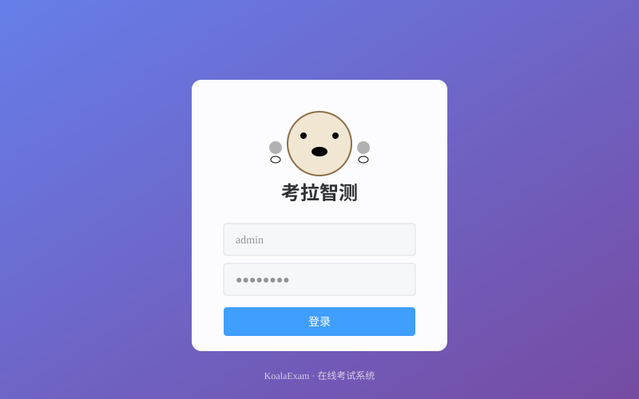
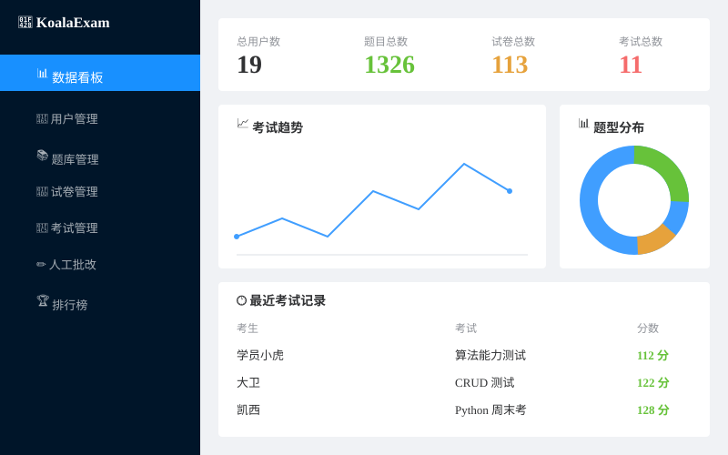
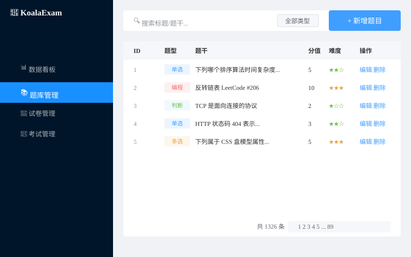
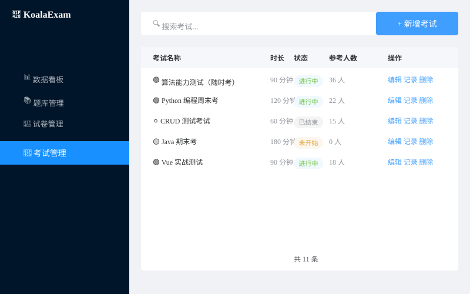
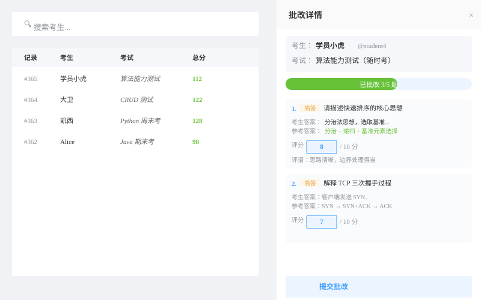
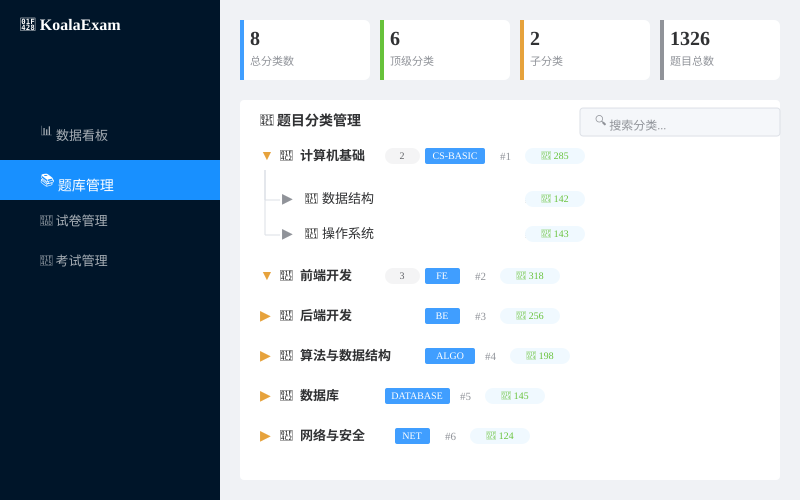

<div align="center">

# KoalaExam(考拉智测)

### 基于 Golang (Hertz) + Vue 3 的企业级在线考试系统

[]() []() []() []()

[核心特性](#-核心特性) - [技术栈](#-技术栈) - [快速开始](#-快速开始) - [系统截图](#-系统截图) - [项目结构](#-项目结构) - [数据库](#-数据库) - [API 文档](#-api-文档) - [开发指南](#-开发指南)

</div>

---

## 项目简介

KoalaExam 是一套面向 K12 / 高校 / 企业培训场景的**全栈在线考试系统**，采用**前后端分离架构 + Clean Architecture 分层 + GORM** 实现。

- **后端**：字节跳动开源的 Hertz 框架(基于自研高性能网络库 Netpoll)+ GORM + MySQL(KoalaExam 库, ke_ 前缀)+ Redis
- **前端**：Vue 3 + TypeScript + Vite + Pinia + Element Plus, 现代化、类型安全、组件丰富
- **特色**:6 种题型支持、智能组卷、防作弊体系、人工批改、ECharts 数据可视化、JWT + bcrypt 安全

---

## 核心特性

### 功能完整(18 大模块)

| 模块 | 功能 |
|------|------|
| 用户认证 | JWT 双 Token、bcrypt 加密、RBAC 三级权限 |
| 用户管理 | 增删改查、批量导入、密码重置、状态切换 |
| 题库管理 | 6 种题型(单选/多选/判断/填空/不定项/编程)、CRUD、批量导入 |
| 分类管理 | 树形结构、统计题目数、智能编码 |
| 试卷管理 | 手动组卷/随机组卷/遗传算法 3 种策略、试卷预览 |
| 考试管理 | CRUD 全功能、状态机、时间窗口、目标用户、防作弊开关 |
| 人工批改 | 抽屉式批改、批量提交、评语、进度跟踪 |
| 学员考试 | 考试大厅、答题界面(倒计时/自动保存)、断线续考 |
| 自动阅卷 | 客观题自动评分、错题自动收录 |
| 收藏系统 | 自定义收藏夹、批量收藏、批量管理 |
| 错题本 | 智能归类、掌握度评级(1-5星)、薄弱点分析 |
| 数据统计 | Dashboard(4 卡 + 趋势 + 饼图)、考试概览 |
| 排行榜 | 分数排名、参考人数、通过率 |
| 个人中心 | 资料编辑、修改密码、学习统计 |
| 搜索过滤 | 多维度筛选、关键词搜索 |
| 树形展示 | 分类管理树形 UI |
| 防作弊 | 全屏监控、切屏检测、题目乱序、选项随机、禁止复制粘贴 |
| 审计日志 | 所有接口审计、SHA-256 成绩签名防篡改 |

### 技术亮点

- Hertz + Netpoll 高性能 HTTP 服务(字节跳动自研网络库)
- Clean Architecture + DDD 分层：application / domain / infrastructure / interfaces
- JWT + 中间件链：Recovery / CORS / RateLimit / Audit
- Redis 缓存：答题进度、断线续考、登录限流
- 数据安全：bcrypt 密码 + SHA-256 成绩签名
- 可观测性：Zap 结构化日志 + Lumberjack 自动切割
- 组件丰富：25 个 Vue 视图、20 个 TS 模块

---

## 技术栈

### 后端

| 类别 | 技术 | 版本 |
|------|------|------|
| 语言 | Go | 1.22+ |
| HTTP | CloudWeGo Hertz | v0.7.0 |
| 网络库 | Netpoll | - |
| ORM | GORM | v1.25.4 |
| 数据库 | MySQL | 8.0 |
| 缓存 | Redis | 7.x |
| 配置 | Viper | v1.18.0 |
| 日志 | Uber Zap + Lumberjack | v1.26.0 |
| 认证 | JWT v5 + bcrypt | - |
| 验证 | go-playground/validator | v10 |

### 前端

| 类别 | 技术 | 版本 |
|------|------|------|
| 框架 | Vue 3 | 3.x |
| 语言 | TypeScript | 5.x |
| 构建 | Vite | 5.4.21 |
| 状态 | Pinia | 2.x |
| 路由 | Vue Router | 4.x |
| UI | Element Plus | 2.9 |
| HTTP | Axios | - |
| 图表 | ECharts | 5.5 |
| 时间 | Day.js | - |
| 样式 | SCSS | - |

---

## 快速开始

### 一键启动(推荐)

```bash
# 克隆项目
git clone <repo-url> koala-exam
cd koala-exam

# 启动 MySQL + Redis + 自动建库建表 + 测试数据 + 后端 + 前端
./scripts/start.sh

# 访问
# 前端:  http://localhost:5173
# 后端:  http://localhost:8080
# MySQL: localhost:3306 (root/123456, db=KoalaExam)
```

### 手动启动

#### 1. 启动基础设施

```bash
# 启动 MySQL + Redis
docker compose up -d

# 或手动启动(已有数据库)
docker run -d --name ke-mysql -p 3306:3306 \
  -e MYSQL_ROOT_PASSWORD=123456 \
  -e MYSQL_DATABASE=KoalaExam \
  mysql:8.0
docker run -d --name ke-redis -p 6379:6379 redis:7-alpine
```

#### 2. 启动后端

```bash
cd backend
go mod tidy

# 一键建库建表 + 写入测试数据 + 启动
./start-server.sh

# 或手动:
mysql -uroot -p123456 < migrations/init/*.sql  # 初始化
go run ./cmd/hertz                            # 启动(默认 :8080)
```

#### 3. 启动前端

```bash
cd frontend
pnpm install
pnpm dev    # http://localhost:5173
```

### 环境变量(后端)

```bash
export APP_ENV=dev                  # dev / prod
export MYSQL_DSN=root:123456@tcp(127.0.0.1:3306)/KoalaExam?charset=utf8mb4
export REDIS_ADDR=127.0.0.1:6379
export JWT_SECRET=koala-jwt-secret
export SERVER_PORT=8080
```

---

## 系统截图

<details>
<summary><b>登录页</b>(点击展开)</summary>



紫色渐变背景 + 考拉图标，简洁现代的登录界面。

</details>

<details>
<summary><b>管理后台 Dashboard</b>(点击展开)</summary>



左侧菜单 + 顶部 4 个统计卡 + 考试趋势折线图 + 题型分布饼图 + 最近考试记录。

</details>

<details>
<summary><b>题库管理</b>(点击展开)</summary>



支持 6 种题型(单选/多选/判断/填空/不定项/编程)，1326+ 题目，分页浏览。

</details>

<details>
<summary><b>考试管理</b>(点击展开)</summary>



考试列表 + 状态标签(进行中/未开始/已结束)+ 操作菜单。

</details>

<details>
<summary><b>人工批改详情</b>(点击展开)</summary>



抽屉式批改界面：左侧考生记录列表，右侧显示完整试卷 + 考生答案 + 参考答案 + 评分 + 评语。

</details>

<details>
<summary><b>题目分类管理(树形)</b>(点击展开)</summary>



树形展示 + 题目数统计 + 编码标签 + 排序值 + 操作按钮(hover 显示)。

</details>

> 所有截图均为 SVG 矢量图，可无损缩放查看。

---

## 项目结构

```
koala-exam/
├── backend/                       # Go + Hertz 后端(72 个 Go 文件)
│   ├── cmd/
│   │   └── hertz/                 # 主服务入口(端口 8080)
│   │       └── main.go
│   ├── internal/
│   │   ├── application/           # 应用服务(业务编排)
│   │   │   ├── user/              # 用户业务
│   │   │   ├── question/          # 题目业务
│   │   │   ├── exam/              # 考试业务
│   │   │   ├── grading/           # 阅卷业务
│   │   │   ├── favorite/          # 收藏业务
│   │   │   ├── statistics/        # 统计业务
│   │   │   └── dto/               # 数据传输对象
│   │   ├── domain/                # 领域模型(实体/常量/错误码)
│   │   │   ├── entity/            # 实体定义
│   │   │   ├── consts/            # 常量定义
│   │   │   └── errcode/           # 错误码
│   │   ├── infrastructure/        # 基础设施层
│   │   │   ├── repository/        # 数据仓储
│   │   │   └── cache/             # 缓存
│   │   └── interfaces/            # 接口层
│   │       ├── handler/           # HTTP Handler
│   │       ├── middleware/        # 中间件
│   │       └── router/            # 路由
│   ├── pkg/                       # 公共库
│   │   ├── config/                # 配置加载
│   │   ├── jwt/                   # JWT 工具
│   │   ├── response/              # 统一响应
│   │   ├── logger/                # 日志工具
│   │   ├── utils/                 # 工具函数
│   │   └── encrypt/               # 加密工具
│   ├── configs/                   # YAML 配置
│   ├── migrations/init/           # SQL 初始化脚本
│   ├── scripts/                   # 测试数据脚本
│   │   ├── gen_questions.go       # 题目生成
│   │   ├── gen_questions.js       # 题目生成(JS 版)
│   │   ├── gen_questions.sql      # 1000+ 题目
│   │   └── gen_test_data.sql      # 100+ 考试记录 + 100 试卷
│   ├── start-server.sh            # 后端启动脚本
│   └── go.mod
│
├── frontend/                      # Vue3 + Vite 前端
│   ├── src/
│   │   ├── api/                   # API 封装(20 个 TS 模块)
│   │   ├── components/            # 通用组件
│   │   │   └── business/          # 业务组件
│   │   ├── composables/           # 组合式函数
│   │   ├── layouts/               # 布局
│   │   │   ├── DefaultLayout.vue
│   │   │   ├── AdminLayout.vue    # 管理后台布局
│   │   │   └── StudentLayout.vue  # 学员布局
│   │   ├── router/                # 路由
│   │   ├── store/                 # Pinia 状态
│   │   ├── views/                 # 视图(25 个 Vue 文件)
│   │   │   ├── auth/              # 登录
│   │   │   ├── admin/             # 管理后台(10 个)
│   │   │   ├── student/           # 学员(6 个)
│   │   │   ├── error/             # 错误页
│   │   │   └── Profile.vue        # 个人中心
│   │   └── types/                 # TypeScript 类型
│   ├── public/                    # 静态资源
│   └── package.json
│
├── doc/                           # 文档
│   └── images/                    # SVG 系统截图
├── docs/                          # 知识库文档
├── docker-compose.yml             # MySQL + Redis 一键启动
├── scripts/                       # 顶层脚本
└── README.md                      # 本文件
```

---

## 默认账号(密码均为 koala123)

| 账号 | 角色 | 说明 |
|------|------|------|
| **admin** | 超管 (role=1) | 全功能管理 |
| **teacher** | 教师 (role=2) | 题库/试卷/考试管理 |
| **teacher2** | 教师 (role=2) | 备用教师账号 |
| **student** | 学员 (role=3) | 软工1班，含错题/收藏 |
| **student2** | 学员 (role=3) | 软工1班 |
| **student3** | 学员 (role=3) | 软工2班 |
| **student4** | 学员 (role=3) | AI1班 |
| **student5** | 学员 (role=3) | 软工1班 |

> 还有 12 个测试学员(student_david / student_cathy / student_bob / student_alice 等)，均使用相同密码。

---

## 数据库

### 配置

```yaml
database: KoalaExam      # 数据库名
username: root          # 用户
password: "123456"      # 密码
table_prefix: ke_       # 表前缀
charset: utf8mb4        # 字符集
```

### 表清单(12 张，全部 ke_ 前缀)

| # | 表名 | 说明 | 关键索引 | 数据量 |
|---|------|------|----------|--------|
| 1 | ke_department | 组织/院系 | idx_parent | 5 |
| 2 | ke_class | 班级 | idx_dept, idx_teacher | 3 |
| 3 | ke_user | 用户 | uniq_username, idx_role, idx_status | 19 |
| 4 | ke_question_category | 题库分类 | idx_parent | 9 |
| 5 | ke_question | 题目 | idx_category, idx_type, idx_difficulty | **1326** |
| 6 | ke_paper | 试卷 | idx_creator, idx_status | 114 |
| 7 | ke_paper_question | 试卷-题目关联 | uniq_paper_q | 32+ |
| 8 | ke_exam | 考试 | idx_paper, idx_status, idx_start, idx_end | 13 |
| 9 | ke_exam_record | 考试记录 | uniq_exam_user, idx_status | **125** |
| 10 | ke_favorite_folder | 收藏夹 | idx_user | 13 |
| 11 | ke_favorite | 收藏主表 | uniq_user_target | 22+ |
| 12 | ke_wrong_log | 错题日志 | idx_user_q, idx_mastery | 18+ |

### 关键设计

- 软删除：所有表均含 deleted_at 字段(GORM 软删除)
- 审计字段：created_at / updated_at
- 字段类型：题目用 JSON 存选项/答案、试卷用 JSON 存题目快照
- 成绩签名：score_hash 用 SHA-256 防篡改

---

## 测试数据

初始化后数据库包含：

- 5 个组织(计算机学院 / 软件工程系 / 人工智能系 / 外语学院 / 经管学院)
- 3 个班级(软工1班 / 软工2班 / AI1班)
- 19 个用户(1 超管 + 2 教师 + 16 学员)
- 9 个题库分类(含 2 个嵌套子分类)
- 1326 道题目(覆盖 6 种题型：单选/多选/判断/填空/不定项/编程)
- 114 张试卷(14 原始 + 100 自动生成, 固定/随机/GA 三种策略)
- 13 场考试(含长期开放的可重复考试)
- 125 条考试记录(含 100+ 条人工批改数据)
- 22 个收藏(13 个收藏夹)
- 18 条错题日志(含掌握度评级 1-5 星)

---

## API 文档

### 接口总览(57 个接口)

#### 认证模块(4 个)
- POST /api/v1/auth/login - 登录
- POST /api/v1/auth/refresh - 刷新 Token
- POST /api/v1/auth/logout - 登出
- GET /api/v1/user/profile - 获取个人资料

#### 用户模块(8 个)
- GET/POST/PUT/DELETE /admin/users[/:id] - CRUD
- PUT /admin/users/:id/status - 切换状态
- POST /admin/users/:id/reset-password - 重置密码
- PUT /user/profile - 更新个人资料
- PUT /user/password - 修改密码

#### 题目模块(7 个)
- GET/POST/PUT/DELETE /questions[/:id] - CRUD
- POST /questions/import - 批量导入
- GET/POST/PUT/DELETE /question-categories[/:id] - 分类 CRUD

#### 试卷模块(5 个)
- GET/POST/PUT/DELETE /papers[/:id] - CRUD

#### 考试模块(14 个)
- GET/POST/PUT/DELETE /exams[/:id] - CRUD
- GET /exams/:id/records - 考试记录
- GET /admin/exam-records - 管理员视角的考试记录
- GET /exams/available - 学员可参加的考试
- POST /exams/:id/start - 开始考试
- POST /exams/answer - 保存答案
- POST /exams/audit - 行为审计
- POST /exams/submit - 交卷
- POST /grading/subjective - 主观题评分
- POST /grading/subjective/batch - 批量主观题评分

#### 统计模块(3 个)
- GET /stats/dashboard - Dashboard
- GET /stats/exam/:id - 考试概览
- GET /stats/me - 个人学习统计

#### 收藏模块(11 个)
- 收藏/收藏夹/错题本完整 CRUD

#### 健康检查(1 个)
- GET /health - 健康检查

### 统一响应格式

```json
{
  "code": 0,
  "message": "success",
  "data": { ... }
}
```

### 错误码规范

- 0 - 成功
- 100001 - 参数错误
- 100002 - 未授权
- 100004 - 资源不存在
- 100005 - 内部错误
- 200002 - Token 过期
- 200005 - Token 刷新失败

---

## 开发指南

### 代码规范

- Go：遵循 gofmt + golint，接口命名驼峰，错误处理用 errcode
- Vue：Composition API + TypeScript，避免 emoji 在模板中
- 目录：后端用 DDD 分层(cmd / internal / pkg)，前端按职责分层(api / views / components / store / composables)

### 添加新接口流程

1. 在 internal/domain/entity 定义实体
2. 在 internal/application/dto 定义 DTO
3. 在 internal/infrastructure/repository 实现仓储
4. 在 internal/application/{module} 实现业务
5. 在 internal/interfaces/handler 实现 Handler
6. 在 internal/interfaces/router 注册路由

### 添加新页面流程

1. 在 frontend/src/api/modules 定义 API
2. 在 frontend/src/views/{module} 创建页面
3. 在 frontend/src/router/index.ts 注册路由
4. 在对应 layouts/{role}.vue 添加菜单

### 日志查看

```bash
# 后端实时日志
tail -f /tmp/koala-backend.log

# Vite 实时日志
tail -f /tmp/vite.log

# Docker 日志
docker logs -f mailang-mysql
```

---

## 项目统计

| 维度 | 数量 |
|------|------|
| 后端 Go 文件 | 72 |
| 后端 SQL 文件 | 4 |
| 后端接口 | 57 |
| 后端应用模块 | 7(user / question / exam / grading / favorite / statistics / dto) |
| 前端 Vue 文件 | 25 |
| 前端 TS 文件 | 20 |
| 数据库表 | 12 |
| 题目数 | 1326 |
| 试卷数 | 114 |
| 考试数 | 13 |
| 考试记录 | 125 |
| 用户数 | 19 |

---

## 致谢

本项目参考了以下优秀开源项目：

- [芋道源码 yudao-cloud-ui-admin-vue3](https://gitee.com/yudao-cloud/yudao-cloud-ui-admin-vue3) - 前端 UI 参考
- [CloudWeGo Hertz](https://www.cloudwego.io/zh/docs/hertz/) - HTTP 框架
- [Element Plus](https://element-plus.org/) - UI 组件库
- [GORM](https://gorm.io/) - ORM 框架

---

## License

MIT

---

<div align="center">

如果这个项目对你有帮助，请给一个 Star！

Made with love by KoalaExam Team

</div>